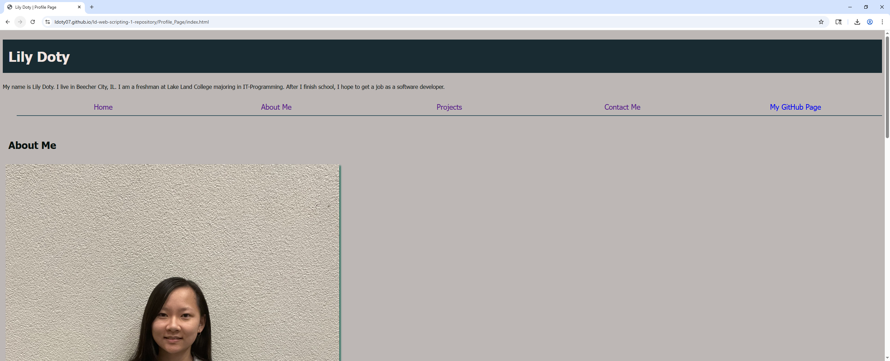
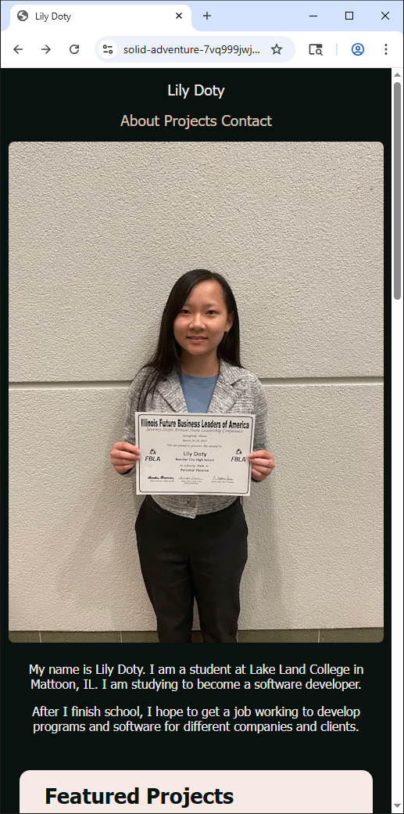
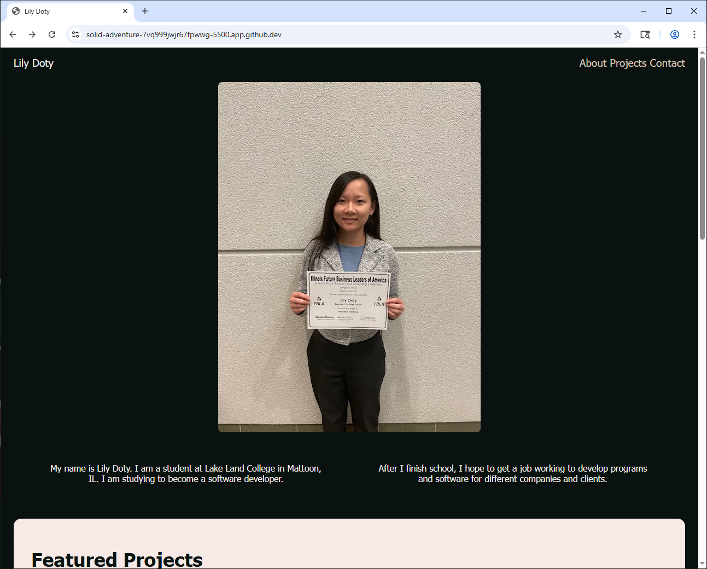
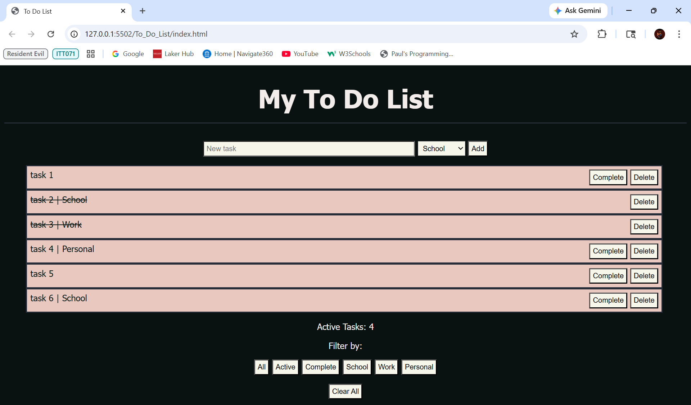

This is the repository I will be using for my Web Scripting 1 assignments.

The website has been updated. It has a little bit about me, I added CSS, and I added the landing page. There is also a toggleable dark/light mode for the landing page.

I added a new to-do list page. It allows you to add tasks, attach an optional tag to each task, mark tasks as complete, delete tasks, and filter tasks.

Pages:
    index.html (Landing Page)
    index.html (Home)
    about.html (About Me)
    projects.html (Projects)
    contact.html (Contact Me)

